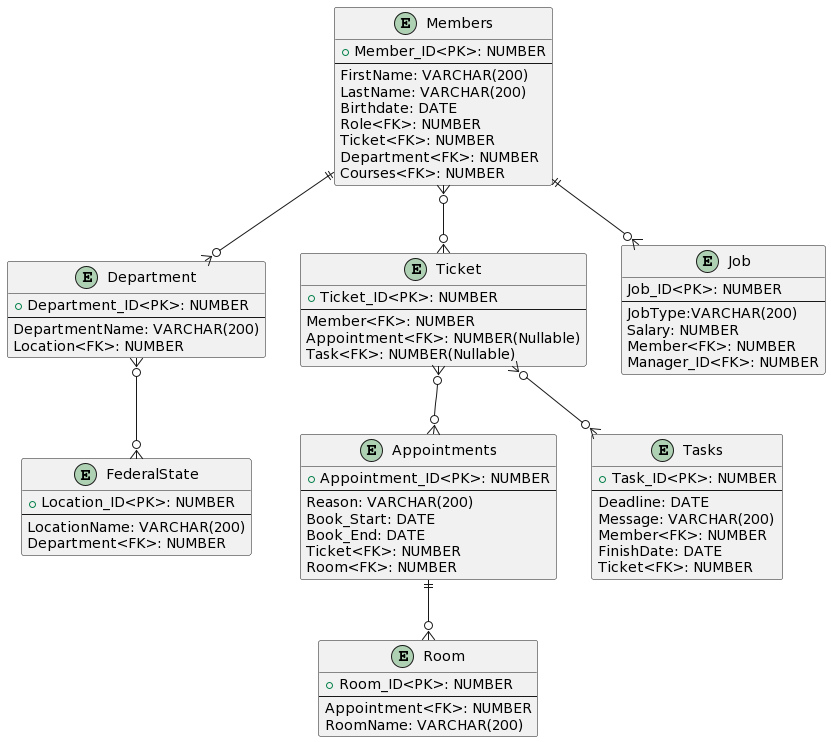

# AA-DBI-WH-3.Jg

## Vom ERD zum Trigger

### Fachdomäne
Wir sind ein Dienstleistungsunternhemen eines Handwerkerunternhemens, dass das einen groben Teil vom der Datenverwaltung der Mitarbeiter managed. Die Mitarbeiter müssen mit Vor- & Nachname, Geburtsdatum eingetragen werden.  Jeder Mitarbeiter hat naturlich einen Standort von dem Unternehmen, wo er arbeitet. Weil das Unternehmen sich sehr ausgeprägt ist. Sind die Standort in den verschiedensten Bundesländern Österreichs verbreitet. Da auch die Mitarbeiter nicht nur rumstehen und nichts tun gibt es ein Ticket System in unserem Unternehmen. Das Ticketsystem ist wie eine Log-History. Man hat immer den überblick, was gerade im Unternhemen abgeht. Ein Ticket kann mehrere Task beinhalten oder garkeine. Genau ist es auch bei den Terminen/Meetings. Sie gehören auch zu dem Ticketsystem dabei können im Ticket auch mehrere Meetings/Termine oder keine haben. Natürlich muss man für ein Meeting einen Raum buchen. Man nucht sie mit der Id des Raumes. Ein Task hat auch eine Deadline, da soll der Task spätestens fertig sein. Wenn man mit einem Task fertig ist und ihn abschließt, hat man dazu ein extra Datum, wo man kennzeichnet, wann der Task fertig gemacht wurde. Jedes Mitglied hat natürlich einen anderen Job mit einem anderen Gehalt. Jeder Mitarbeiter hat auch einen Vorgesetzten (Abteilungsleiter, Manager) die über eine ID gekennzeichnet wird. Eine Ausnahme ist, der CEO, weil er keinen Vorgesetzten hat.

### Relevante Queries

    •	Gib mir alle Tickets eines jeweiligen Mitarbeiter aus
    •	Gib mir alle Standorte aus, wo ein Mitarbeiter arbeitet, der mehr als 2500€ Netto verdient. 
    •	Gib mir alle Termine die zwischen einem Zeitraum sind.
    •	Gib mir alle verfügbaren Räume zur verfügung (bestimmter Zeitraum).
    •	Gib mir alle Mitglieder aus und wie viele Tickets sie derzeit haben.

### ERD

### UML Code
```
@startuml

entity "Members" {
  + Member_ID<PK>: NUMBER
  --
  FirstName: VARCHAR(200)
  LastName: VARCHAR(200)
  Birthdate: DATE
  Role<FK>: NUMBER
  Ticket<FK>: NUMBER
  Department<FK>: NUMBER
  Courses<FK>: NUMBER
}

entity "Roles" {
  + Role_ID<PK>: NUMBER
  --
  Role: VARCHAR(200)
  Manager_ID<FK>: NUMBER
  Member<FK>:NUMBER
}

entity "Department" {
  + Department_ID<PK>: NUMBER
  --
  DepartmentName: VARCHAR(200)
  Location<FK>: NUMBER
}

entity "Location"{
  + Location_ID<PK>: NUMBER
  --
  LocationName: VARCHAR(200)
  Department<FK>: NUMBER
}

entity "Ticket" {
  + Ticket_ID<PK>: NUMBER
  --
  Member<FK>: NUMBER
  Appointment<FK>: NUMBER(Nullable)
  Task<FK>: NUMBER(Nullable)
}

entity "Room"{
  + Room_ID<PK>: NUMBER
  --
  Appointment<FK>: NUMBER
  RoomName: VARCHAR(200)
}

entity "Appointments" {
  + Appointment_ID<PK>: NUMBER
  --
  Reason: VARCHAR(200)
  Book_Start: DATE
  Book_End: DATE
  Ticket<FK>: NUMBER
  Room<FK>: NUMBER
}

entity "Tasks" {
  + Task_ID<PK>: NUMBER
  --
  Deadline: DATE
  Message: VARCHAR(200)
  Member<FK>: NUMBER
  FinishDate: DATE
  Ticket<FK>: NUMBER
}

entity "Courses" {
  + Course_ID<PK>: NUMBER
  --
  Participant<FK>: NUMBER
  Instructor<FK>: NUMBER
  Date: DATE
  Topic: VARCHAR(200)
}

Members ||--o{ Roles
Members ||--o{ Department
Members }o--o{ Ticket 
Members }o--o{ Courses 

Department ||--|| Location

Ticket }o--o{ Appointments
Ticket }o--o{ Tasks

Appointments ||--o{ Room

@enduml
```

### Definition der PL/SQL API

```
CREATE OR REPLACE PACKAGE ServiceCompany AS

    -- CRUD for Members
    PROCEDURE AddMember(firstname IN VARCHAR2, lastname IN VARCHAR2, birthdate IN DATE, role IN NUMBER, department IN NUMBER);
    PROCEDURE UpdateMember(id IN NUMBER, firstname IN VARCHAR2, lastname IN VARCHAR2, birthdate IN DATE, role IN NUMBER, department IN NUMBER);
    PROCEDURE DeleteMember(id IN NUMBER);
    FUNCTION GetMember(id IN NUMBER) RETURN SYS_REFCURSOR;
    
    -- CRUD for Roles
    PROCEDURE AddRole(role IN VARCHAR2, manager_id IN NUMBER);
    PROCEDURE UpdateRole(id IN NUMBER, role IN VARCHAR2, manager_id IN NUMBER);
    PROCEDURE DeleteRole(id IN NUMBER);
    
    -- CRUD for Department
    PROCEDURE AddDepartment(name IN VARCHAR2, head IN NUMBER);
    PROCEDURE UpdateDepartment(id IN NUMBER, name IN VARCHAR2, head IN NUMBER);
    PROCEDURE DeleteDepartment(id IN NUMBER);
    
    -- CRUD for Appointments
    PROCEDURE AddAppointment(time IN TIMESTAMP, reason IN VARCHAR2, date IN DATE, member_id IN NUMBER);
    PROCEDURE UpdateAppointment(id IN NUMBER, time IN TIMESTAMP, reason IN VARCHAR2, date IN DATE, member_id IN NUMBER);
    PROCEDURE DeleteAppointment(id IN NUMBER);
    
    -- CRUD for Tasks
    PROCEDURE AddTask(deadline IN DATE, message IN VARCHAR2, responsible IN NUMBER, finishdate IN DATE := NULL);
    PROCEDURE UpdateTask(id IN NUMBER, deadline IN DATE, message IN VARCHAR2, responsible IN NUMBER, finishdate IN DATE := NULL);

    PROCEDURE DeleteTask(id IN NUMBER);
    
    -- CRUD for Courses
    PROCEDURE AddCourse(instructor IN VARCHAR2, date IN TIMESTAMP, topic IN VARCHAR2);
    PROCEDURE UpdateCourse(id IN NUMBER, instructor IN VARCHAR2, date IN TIMESTAMP, topic IN VARCHAR2);
    PROCEDURE DeleteCourse(id IN NUMBER);
    
    -- CRUD for Courses_Members
    PROCEDURE AddCourseMember(course_id IN NUMBER, member_id IN NUMBER);
    PROCEDURE DeleteCourseMember(course_id IN NUMBER, member_id IN NUMBER);
    
END ServiceCompany;
```
