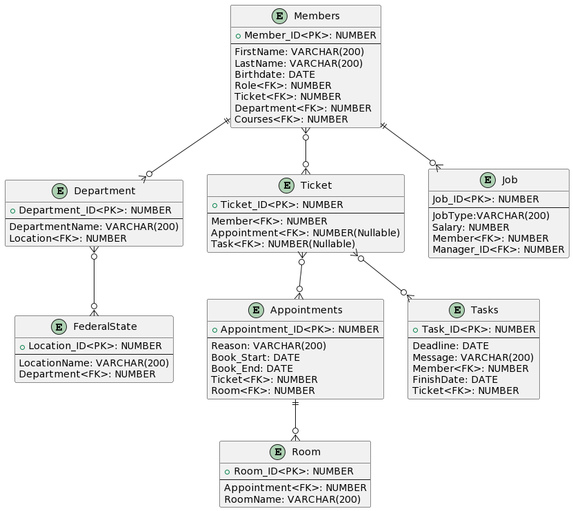

# AA-DBI-WH-3.Jg

## Vom ERD zum Trigger

### Fachdomäne
Wir sind ein Dienstleistungsunternhemen eines Handwerkerunternhemens, dass das einen groben Teil vom der Datenverwaltung der Mitarbeiter managed. Die Mitarbeiter müssen mit Vor- & Nachname, Geburtsdatum eingetragen werden. Jeder Mitarbeiter hat naturlich einen Standort von dem Unternehmen, wo er arbeitet. Weil das Unternehmen sehr ausgeprägt ist. Es gibt Standorte in den verschiedensten Bundesländern Österreichs. 

Da auch die Mitarbeiter nicht nur rumstehen und nichts tun gibt es ein Ticket System in unserem Unternehmen. Das Ticketsystem ist wie eine Log-History. Man hat immer den überblick, was gerade im Unternhemen abgeht. Wann ein Ticket erstellt worden ist und wann es geschlossen wird. Ein Ticket kann mehrere Task beinhalten oder garkeine. Genau ist es auch bei einen Termin/Meeting. Sie gehören auch zu dem Ticketsystem dabei können im Ticket auch mehrere Meetings/Termine oder keine haben. Ein Meeting hat einen Raum über eine ID gebucht, da können mehrere Mitflieder Teilnehmen. Ein Task hat auch eine Deadline, da soll der Task spätestens fertig sein. Wenn man mit einem Task fertig ist und ihn abschließt, hat man dazu ein extra Datum, wo man kennzeichnet, wann der Task fertig gemacht wurde. Die Deadline kann man auch nach hinten verschieben, wenn man es nicht rechtzeitig fertig machen kann. 

Jedes Mitglied hat natürlich einen anderen Job mit einem anderen Gehalt. Ein Mitglied kann nur einen Job haben, aber mehrere Mitglieder können denselber Job gelehrt haben. Jeder Mitarbeiter hat auch einen Vorgesetzten (Abteilungsleiter, Manager) die über eine ID gekennzeichnet wird. Eine Ausnahme ist, der CEO, weil er keinen Vorgesetzten hat.

### Relevante Queries

    •	Gib mir alle Tickets eines jeweiligen Mitarbeiter aus
    •	Gib mir alle Standorte aus, wo ein Mitarbeiter arbeitet, der mehr als 2500€ Netto verdient. 
    •	Gib mir alle Termine die zwischen einem Zeitraum sind.
    •	Gib mir alle verfügbaren Räume zur verfügung (bestimmter Zeitraum).
    •	Gib mir alle Mitglieder aus und wie viele Tickets sie derzeit haben.

### ERD

### UML Code
```
@startuml

entity "Members" {
  + Member_ID<PK>: NUMBER
  --
  FirstName: VARCHAR(200)
  LastName: VARCHAR(200)
  Birthdate: DATE
  Role<FK>: NUMBER
  Ticket<FK>: NUMBER
  Department<FK>: NUMBER
  Courses<FK>: NUMBER
}

entity "Roles" {
  + Role_ID<PK>: NUMBER
  --
  Role: VARCHAR(200)
  Manager_ID<FK>: NUMBER
  Member<FK>:NUMBER
}

entity "Department" {
  + Department_ID<PK>: NUMBER
  --
  DepartmentName: VARCHAR(200)
  Location<FK>: NUMBER
}

entity "Location"{
  + Location_ID<PK>: NUMBER
  --
  LocationName: VARCHAR(200)
  Department<FK>: NUMBER
}

entity "Ticket" {
  + Ticket_ID<PK>: NUMBER
  --
  Member<FK>: NUMBER
  Appointment<FK>: NUMBER(Nullable)
  Task<FK>: NUMBER(Nullable)
}

entity "Room"{
  + Room_ID<PK>: NUMBER
  --
  Appointment<FK>: NUMBER
  RoomName: VARCHAR(200)
}

entity "Appointments" {
  + Appointment_ID<PK>: NUMBER
  --
  Reason: VARCHAR(200)
  Book_Start: DATE
  Book_End: DATE
  Ticket<FK>: NUMBER
  Room<FK>: NUMBER
}

entity "Tasks" {
  + Task_ID<PK>: NUMBER
  --
  Deadline: DATE
  Message: VARCHAR(200)
  Member<FK>: NUMBER
  FinishDate: DATE
  Ticket<FK>: NUMBER
}

entity "Courses" {
  + Course_ID<PK>: NUMBER
  --
  Participant<FK>: NUMBER
  Instructor<FK>: NUMBER
  Date: DATE
  Topic: VARCHAR(200)
}

Members ||--o{ Roles
Members ||--o{ Department
Members }o--o{ Ticket 
Members }o--o{ Courses 

Department ||--|| Location

Ticket }o--o{ Appointments
Ticket }o--o{ Tasks

Appointments ||--o{ Room

@enduml
```

### Definition der PL/SQL API

```
CREATE OR REPLACE PACKAGE ServiceCompany AS
  -- Create operations
  PROCEDURE CreateMember(
    p_FirstName IN VARCHAR2,
    p_LastName IN VARCHAR2,
    p_Birthdate IN DATE
  );

  PROCEDURE CreateRole(
    p_Role IN VARCHAR2
  );

  PROCEDURE CreateMemberRole(
    p_Member_ID IN NUMBER,
    p_Role_ID IN NUMBER
  );

  PROCEDURE CreateDepartment(
    p_DepartmentName IN VARCHAR2
  );

  PROCEDURE CreateDepartmentsFederalState(
    p_Department_ID IN NUMBER,
    p_Location_ID IN NUMBER
  );

  PROCEDURE CreateTicket;

  PROCEDURE CreateMemberTicket(
    p_Member_ID IN NUMBER,
    p_Ticket_ID IN NUMBER
  );

  PROCEDURE CreateJob(
    p_JobType IN VARCHAR2
  );

  PROCEDURE CreateMemberJob(
    p_Member_ID IN NUMBER,
    p_Job_ID IN NUMBER
  );

  PROCEDURE CreateRoom(
    p_RoomName IN VARCHAR2
  );

  PROCEDURE CreateAppointment(
    p_Reason IN VARCHAR2,
    p_Book_Start IN DATE,
    p_Book_End IN DATE
  );

  PROCEDURE CreateMembersDepartment(
    p_Member_ID IN NUMBER,
    p_Department_ID IN NUMBER
  );

  PROCEDURE CreateAppointmentTicket(
    p_Appointment_ID IN NUMBER,
    p_Ticket_ID IN NUMBER
  );

  PROCEDURE CreateAppointmentRoom(
    p_Appointment_ID IN NUMBER,
    p_Room_ID IN NUMBER
  );

  PROCEDURE CreateTask(
    p_Deadline IN DATE,
    p_Message IN VARCHAR2,
    p_FinishDate IN DATE
  );

  PROCEDURE CreateMemberTask(
    p_Member_ID IN NUMBER,
    p_Task_ID IN NUMBER
  );

  PROCEDURE CreateCourse(
    p_CourseDate IN DATE,
    p_Topic IN VARCHAR2
  );

  PROCEDURE CreateCourseParticipant(
    p_Course_ID IN NUMBER,
    p_Member_ID IN NUMBER
  );

  -- Read operations
  FUNCTION GetMemberById(
    p_Member_ID IN NUMBER
  ) RETURN SYS_REFCURSOR;

  FUNCTION GetRoleById(
    p_Role_ID IN NUMBER
  ) RETURN SYS_REFCURSOR;

  FUNCTION GetDepartmentById(
    p_Department_ID IN NUMBER
  ) RETURN SYS_REFCURSOR;

  FUNCTION GetLocationById(
    p_Location_ID IN NUMBER
  ) RETURN SYS_REFCURSOR;

  FUNCTION GetTicketById(
    p_Ticket_ID IN NUMBER
  ) RETURN SYS_REFCURSOR;

  FUNCTION GetJobById(
    p_Job_ID IN NUMBER
  ) RETURN SYS_REFCURSOR;

  FUNCTION GetRoomById(
    p_Room_ID IN NUMBER
  ) RETURN SYS_REFCURSOR;

  FUNCTION GetAppointmentById(
    p_Appointment_ID IN NUMBER
  ) RETURN SYS_REFCURSOR;

  FUNCTION GetTaskById(
    p_Task_ID IN NUMBER
  ) RETURN SYS_REFCURSOR;

  FUNCTION GetCourseById(
    p_Course_ID IN NUMBER
  ) RETURN SYS_REFCURSOR;

  -- Update operations
  PROCEDURE UpdateMember(
    p_Member_ID IN NUMBER,
    p_FirstName IN VARCHAR2,
    p_LastName IN VARCHAR2,
    p_Birthdate IN DATE
  );

  PROCEDURE UpdateRole(
    p_Role_ID IN NUMBER,
    p_Role IN VARCHAR2
  );

  PROCEDURE UpdateDepartment(
    p_Department_ID IN NUMBER,
    p_DepartmentName IN VARCHAR2
  );

  PROCEDURE UpdateLocation(
    p_Location_ID IN NUMBER,
    p_LocationName IN VARCHAR2
  );

  PROCEDURE UpdateTicket(
    p_Ticket_ID IN NUMBER
  );

  PROCEDURE UpdateJob(
    p_Job_ID IN NUMBER,
    p_JobType IN VARCHAR2
  );

  PROCEDURE UpdateRoom(
    p_Room_ID IN NUMBER,
    p_RoomName IN VARCHAR2
  );

  PROCEDURE UpdateAppointment(
    p_Appointment_ID IN NUMBER,
    p_Reason IN VARCHAR2,
    p_Book_Start IN DATE,
    p_Book_End IN DATE
  );

  PROCEDURE UpdateTask(
    p_Task_ID IN NUMBER,
    p_Deadline IN DATE,
    p_Message IN VARCHAR2,
    p_FinishDate IN DATE
  );

  PROCEDURE UpdateCourse(
    p_Course_ID IN NUMBER,
    p_CourseDate IN DATE,
    p_Topic IN VARCHAR2
  );

  -- Delete operations
  PROCEDURE DeleteMember(
    p_Member_ID IN NUMBER
  );

  PROCEDURE DeleteRole(
    p_Role_ID IN NUMBER
  );

  PROCEDURE DeleteDepartment(
    p_Department_ID IN NUMBER
  );

  PROCEDURE DeleteLocation(
    p_Location_ID IN NUMBER
  );

  PROCEDURE DeleteTicket(
    p_Ticket_ID IN NUMBER
  );

  PROCEDURE DeleteJob(
    p_Job_ID IN NUMBER
  );

  PROCEDURE DeleteRoom(
    p_Room_ID IN NUMBER
  );

  PROCEDURE DeleteAppointment(
    p_Appointment_ID IN NUMBER
  );

  PROCEDURE DeleteTask(
    p_Task_ID IN NUMBER
  );

  PROCEDURE DeleteCourse(
    p_Course_ID IN NUMBER
  );
END ServiceCompany;
/

```

