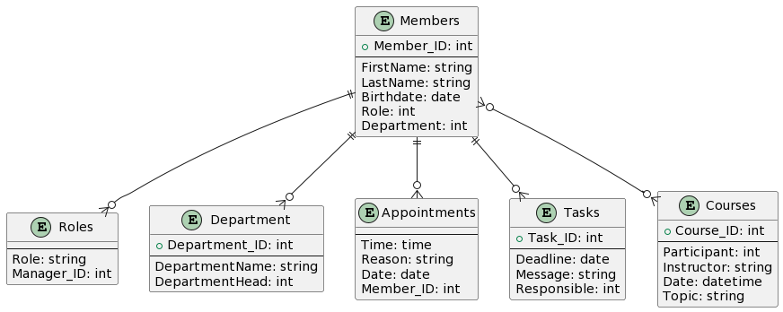

# AA-DBI-WH-3.Jg

## Vom ERD zum Trigger

### Fachdomäne
Wir sind in einem Dienstleistungsunternehmen(Handwerkunternhemen), wo wir der Sys.Admin Gruppe sind und wir müssen eine DB auf setzten wo wir die Mitglieder und die Rollen der Mitglieder verwalten. Dazu kann ein Mitglied Verschiedene Termine haben (z.B.: Wöchentliche Meetings). Natürlich hat jedes Mitglied Task zu erledigen, über den Tag/ die Woche. Neben Tasks und Termine haben auch Mitglieder Kurse wobei sie sich weiterbilden können. Ein Grober überblick über die ERD: 

    •	Termine(Uhrzeit, Grund, Datum, ...)
    •	Rollen(Rolle, Manager ID)
    •	Mitglieder(Vorname, Nachname, Geburtstag, Rolle, Abteilung, ...)
    •	Kurse(ID Person, IDLerhperson, DatumABgeschlossen(dd.mm.jjjj hh:mm), Gebiet, ..)
    •	Tasks(Deadline(Datum), Message, Verantwortlicher, ...)
    •	Abteilung(Name der Abteilung, Name des Abetilungsleiter, ....)

### Relevante Queries

    •	Gib alle Task aus die Gerade ein Mitarbeiter zu tun hat.
    •	Geben mir jeweils alle Mitglieder mit ihren Rollen aus.
    •	Gib mir alle Termine die zwischen einem Zeitraum sind.
    •	Gib mir alle Abteilungen aus und wo welcher Mitarbeiter arbeitet.
    •	Alle Kurse die ein Mitglied abgeschlossen hat.
    •	Gib mir alle Mitglieder aus und wie viele Tasks sie derzeit haben

### ERD

### UML Code
```
@startuml

entity "Members" {
  + Member_ID: int
  --
  FirstName: string
  LastName: string
  Birthdate: date
  Role: int
  Department: int
}

entity "Roles" {
  --
  Role: string
  Manager_ID: int
}

entity "Department" {
  + Department_ID: int
  --
  DepartmentName: string
  DepartmentHead: int
}

entity "Appointments" {
  --
  Time: time
  Reason: string
  Date: date
  Member_ID: int
}

entity "Tasks" {
  + Task_ID: int
  --
  Deadline: date
  Message: string
  Responsible: int
}

entity "Courses" {
  + Course_ID: int
  --
  Participant: int
  Instructor: string
  Date: datetime
  Topic: string
}

Members ||--o{ Roles
Members ||--o{ Department
Members ||--o{ Appointments
Members ||--o{ Tasks 
Members }o--o{ Courses 

@enduml
```

### Definition der PL/SQL API

```
CREATE OR REPLACE PACKAGE ServiceCompany AS

    -- CRUD for Members
    PROCEDURE AddMember(firstname IN VARCHAR2, lastname IN VARCHAR2, birthdate IN DATE, role IN NUMBER, department IN NUMBER);
    PROCEDURE UpdateMember(id IN NUMBER, firstname IN VARCHAR2, lastname IN VARCHAR2, birthdate IN DATE, role IN NUMBER, department IN NUMBER);
    PROCEDURE DeleteMember(id IN NUMBER);
    FUNCTION GetMember(id IN NUMBER) RETURN SYS_REFCURSOR;
    
    -- CRUD for Roles
    PROCEDURE AddRole(role IN VARCHAR2, manager_id IN NUMBER);
    PROCEDURE UpdateRole(id IN NUMBER, role IN VARCHAR2, manager_id IN NUMBER);
    PROCEDURE DeleteRole(id IN NUMBER);
    
    -- CRUD for Department
    PROCEDURE AddDepartment(name IN VARCHAR2, head IN NUMBER);
    PROCEDURE UpdateDepartment(id IN NUMBER, name IN VARCHAR2, head IN NUMBER);
    PROCEDURE DeleteDepartment(id IN NUMBER);
    
    -- CRUD for Appointments
    PROCEDURE AddAppointment(time IN TIMESTAMP, reason IN VARCHAR2, date IN DATE, member_id IN NUMBER);
    PROCEDURE UpdateAppointment(id IN NUMBER, time IN TIMESTAMP, reason IN VARCHAR2, date IN DATE, member_id IN NUMBER);
    PROCEDURE DeleteAppointment(id IN NUMBER);
    
    -- CRUD for Tasks
    PROCEDURE AddTask(deadline IN DATE, message IN VARCHAR2, responsible IN NUMBER);
    PROCEDURE UpdateTask(id IN NUMBER, deadline IN DATE, message IN VARCHAR2, responsible IN NUMBER);
    PROCEDURE DeleteTask(id IN NUMBER);
    
    -- CRUD for Courses
    PROCEDURE AddCourse(instructor IN VARCHAR2, date IN TIMESTAMP, topic IN VARCHAR2);
    PROCEDURE UpdateCourse(id IN NUMBER, instructor IN VARCHAR2, date IN TIMESTAMP, topic IN VARCHAR2);
    PROCEDURE DeleteCourse(id IN NUMBER);
    
    -- CRUD for Courses_Members
    PROCEDURE AddCourseMember(course_id IN NUMBER, member_id IN NUMBER);
    PROCEDURE DeleteCourseMember(course_id IN NUMBER, member_id IN NUMBER);
    
END ServiceCompany;
```
